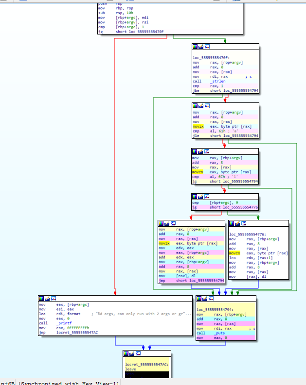
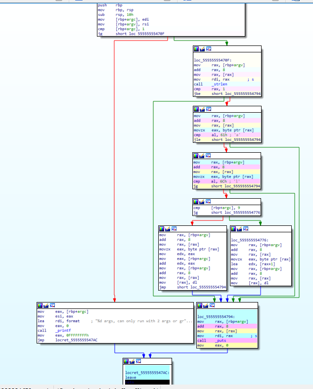

# graceTray


## Problem:

small tool for coloring disassembled instructions in ida or binary ninja for coverage on target methods.

To start, this tool requires you to first determine which routine that it is you want to measure where the code is going to go.

consider the following source code:

```c
#include <stdio.h>
#include <string.h>

int main(int argc, char** argv)
{
    if (argc < 2)
    {
        printf("%d args, can only run with 2 args or greater\n", argc);
        return -1;
    }
    if (strlen(argv[1]) > 1)
    {
        if (argv[1][0] > 'a' && argv[1][0] <= 'l')
        {
            if (argc < 10)
                argv[1][0] += argc;
            else
                argv[1][0] += 1;
        }
    }

    printf("%s\n", argv[1]);
    return 0;
}
```

Its not very difficult to determine where the code is going to go. We can easily see that at the end of an identified main routine compiled of this source, that we will be printing the second arg for the called process. Problem being that if we ran the routine with `./file.x lol`, we see the output `mol` instead of `lol`.

To rectify this, lets consider a scenario in which the routine is much more complex. If we know the outcome that is performed, the print statement, but we have no idea where the mutation occurs, we can spend hours reversing the binary or just run a trace and see the difference between the correct execution and the incorrect execution.

The scenario that I want to emphasize is that even in the case that the correct output is generated, lol, it may stil matter more to view the location of the mutation. By viewing side by side idbs of the correct run and incorrect run, you can narrow down what is happening and deduce how solutions to get variations of the input to generate the same output.

## binary ninja solution:


## gdb -> ida solution

To start, calling args for our trace are the module beginning, module end and the destination of the trace. These are presented to the python file gdbTrace.py in a local text file named args.txt. With info proc mappings output looking like so:

```
(gdb) info proc mappings
process 11850
Mapped address spaces:

          Start Addr           End Addr       Size     Offset objfile
      0x555555554000     0x555555555000     0x1000        0x0 /home/mariomain/Documents/file.x
      0x555555754000     0x555555755000     0x1000        0x0 /home/mariomain/Documents/file.x
      0x555555755000     0x555555756000     0x1000     0x1000 /home/mariomain/Documents/file.x
      0x7ffff79e4000     0x7ffff7bcb000   0x1e7000        0x0 /lib/x86_64-linux-gnu/libc-2.27.so
    ...
      0x7ffffffde000     0x7ffffffff000    0x21000        0x0 [stack]
  0xffffffffff600000 0xffffffffff601000     0x1000        0x0 [vsyscall]
```

Our module beginning is address `0x555555554000` while our end can be `0x555555756000`. To be honest the tracing goes uses finish when it breaks out of the target range, so that range can be a routine instead of a module, but for tracing some of the recursion we will keep it as so. With a main disassembly displayed as:

```
(gdb) disas main
Dump of assembler code for function main:
   0x00005555555546da <+0>:    push   rbp
   0x00005555555546db <+1>:    mov    rbp,rsp
   0x00005555555546de <+4>:    sub    rsp,0x10
   0x00005555555546e2 <+8>:    mov    DWORD PTR [rbp-0x4],edi
   0x00005555555546e5 <+11>:    mov    QWORD PTR [rbp-0x10],rsi
=> 0x00005555555546e9 <+15>:    cmp    DWORD PTR [rbp-0x4],0x1
   0x00005555555546ed <+19>:    jg     0x55555555470f <main+53>
   0x00005555555546ef <+21>:    mov    eax,DWORD PTR [rbp-0x4]
   0x00005555555546f2 <+24>:    mov    esi,eax
   0x00005555555546f4 <+26>:    lea    rdi,[rip+0x13d]        # 0x555555554838
   0x00005555555546fb <+33>:    mov    eax,0x0
   0x0000555555554700 <+38>:    call   0x5555555545b0 <printf@plt>
   0x0000555555554705 <+43>:    mov    eax,0xffffffff
   0x000055555555470a <+48>:    jmp    0x5555555547ac <main+210>
   0x000055555555470f <+53>:    mov    rax,QWORD PTR [rbp-0x10]
   0x0000555555554713 <+57>:    add    rax,0x8
   0x0000555555554717 <+61>:    mov    rax,QWORD PTR [rax]
   0x000055555555471a <+64>:    mov    rdi,rax
   0x000055555555471d <+67>:    call   0x5555555545a0 <strlen@plt>
   0x0000555555554722 <+72>:    cmp    rax,0x1
   0x0000555555554726 <+76>:    jbe    0x555555554794 <main+186>
   0x0000555555554728 <+78>:    mov    rax,QWORD PTR [rbp-0x10]
   0x000055555555472c <+82>:    add    rax,0x8
   0x0000555555554730 <+86>:    mov    rax,QWORD PTR [rax]
   0x0000555555554733 <+89>:    movzx  eax,BYTE PTR [rax]
   0x0000555555554736 <+92>:    cmp    al,0x61
   0x0000555555554738 <+94>:    jle    0x555555554794 <main+186>
   0x000055555555473a <+96>:    mov    rax,QWORD PTR [rbp-0x10]
   0x000055555555473e <+100>:    add    rax,0x8
   0x0000555555554742 <+104>:    mov    rax,QWORD PTR [rax]
   0x0000555555554745 <+107>:    movzx  eax,BYTE PTR [rax]
   0x0000555555554748 <+110>:    cmp    al,0x6c
   0x000055555555474a <+112>:    jg     0x555555554794 <main+186>
   0x000055555555474c <+114>:    cmp    DWORD PTR [rbp-0x4],0x9
   0x0000555555554750 <+118>:    jg     0x555555554776 <main+156>
   0x0000555555554752 <+120>:    mov    rax,QWORD PTR [rbp-0x10]
   0x0000555555554756 <+124>:    add    rax,0x8
   0x000055555555475a <+128>:    mov    rax,QWORD PTR [rax]
   0x000055555555475d <+131>:    movzx  eax,BYTE PTR [rax]
   0x0000555555554760 <+134>:    mov    edx,eax
   0x0000555555554762 <+136>:    mov    eax,DWORD PTR [rbp-0x4]
   0x0000555555554765 <+139>:    add    edx,eax
   0x0000555555554767 <+141>:    mov    rax,QWORD PTR [rbp-0x10]
   0x000055555555476b <+145>:    add    rax,0x8
   0x000055555555476f <+149>:    mov    rax,QWORD PTR [rax]
   0x0000555555554772 <+152>:    mov    BYTE PTR [rax],dl
   0x0000555555554774 <+154>:    jmp    0x555555554794 <main+186>
   0x0000555555554776 <+156>:    mov    rax,QWORD PTR [rbp-0x10]
   0x000055555555477a <+160>:    add    rax,0x8
   0x000055555555477e <+164>:    mov    rax,QWORD PTR [rax]
   0x0000555555554781 <+167>:    movzx  eax,BYTE PTR [rax]
   0x0000555555554784 <+170>:    lea    edx,[rax+0x1]
   0x0000555555554787 <+173>:    mov    rax,QWORD PTR [rbp-0x10]
   0x000055555555478b <+177>:    add    rax,0x8
   0x000055555555478f <+181>:    mov    rax,QWORD PTR [rax]
   0x0000555555554792 <+184>:    mov    BYTE PTR [rax],dl
   0x0000555555554794 <+186>:    mov    rax,QWORD PTR [rbp-0x10]
   0x0000555555554798 <+190>:    add    rax,0x8
   0x000055555555479c <+194>:    mov    rax,QWORD PTR [rax]
   0x000055555555479f <+197>:    mov    rdi,rax
   0x00005555555547a2 <+200>:    call   0x555555554590 <puts@plt>
   0x00005555555547a7 <+205>:    mov    eax,0x0
   0x00005555555547ac <+210>:    leave  
   0x00005555555547ad <+211>:    ret    
```

We want to break somewhere towards the beginning of the main, and the third argument of the args.txt should be `0x00005555555547ad`, the return statement. We can then run our script with source gdbTrace.py.

Lastly we run the file `genSetColorTrace.py` with inputs for our functions beginning, end and the input file generated gdbTrace.txt. The file `gdbTrace.txt.py` can then be used for our idb.

running this twice with input `kol` and `mol` shows:



